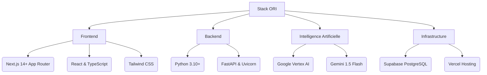
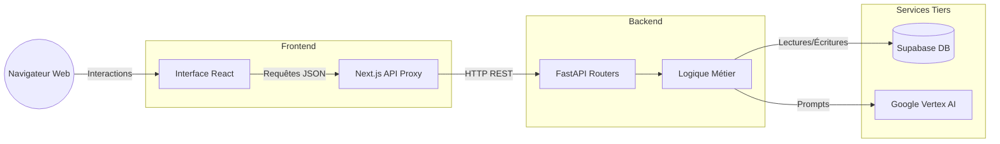
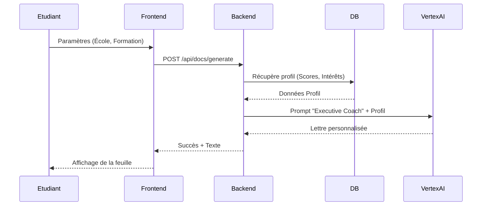

# 🎓 ORI - L'Étudiant : Plateforme d'Orientation Augmentée par l'IA

    

**ORI** est une plateforme "Executive" de nouvelle génération conçue pour le groupe L'Étudiant. Elle a pour ambition de réinventer l'orientation scolaire en couplant une expérience de "gamification cognitive" (Alberthon) avec la puissance de l'Intelligence Artificielle Générative (Google Vertex AI) pour offrir un accompagnement sur-mesure aux étudiants de haut niveau.

---

## ✨ Fonctionnalités Principales

*   🎮 **Évaluation Cognitive Gamifiée (Alberthon) :** Mini-jeux chronométrés (Logique, Maths, Comportement) pour générer un "Persona" étudiant précis basé sur ses *Soft Skills* et *Hard Skills*.
*   📄 **Générateur de Documents "Docs" :** Rédaction ultra-personnalisée (Niveau Executive Coach) de CV, Lettres de motivation et Projets motivés Parcoursup par Gemini 1.5 Flash, utilisant le profil cognitif complet de l'étudiant.
*   📰 **Executive Insights (Newsletter) :** Flux d'actualités Premium (Tech, Finance, VC, Entrepreneuriat) adapté dynamiquement au parcours ciblé de l'étudiant (ex: HEC, Mines Paris, 42).
*   💬 **Agent d'Orientation Conversationnel :** Chatbot IA intelligent capable de piocher dans l'historique et le persona de l'utilisateur pour formuler des conseils d'orientation précis.
*   🛤 **Parcours Utilisateur Dynamique :** Frise chronologique retraçant l'évolution académique et les accomplissements de l'étudiant sur la plateforme (Salons réservés, Persona généré).

---

## 🏗 Stack Technique & Flow de Données

L'application repose sur une architecture moderne de type **Jamstack / Microservices**, pensée pour la scalabilité, la rapidité d'exécution et l'intégration de flux d'Intelligence Artificielle complexes.

### 1. La Stack Technique (Écosystème)



### 2. Architecture Globale (Data Flow)



### 3. Séquence : Génération de Documents IA



---

## 🚀 Démarrage Rapide (Recommandé)

Pour lancer le frontend et le backend avec une seule commande, utilisez notre script d'automatisation. 

```bash
# 1. Donnez les droits d'exécution au script (à faire une seule fois)
chmod +x start.sh

# 2. Lancez les deux serveurs en parallèle
./start.sh
```

Une fois lancé, vos accès sont :
- 🎨 **Interface Web (ORI) :** [http://localhost:3000](http://localhost:3000)
- ⚙️ **API (Swagger Documentation) :** [http://localhost:8000/docs](http://localhost:8000/docs)

*(Appuyez sur `CTRL + C` dans le terminal principal pour arrêter proprement tous les services).*

---

## 💻 Démarrage Manuel & Développement

Si vous souhaitez isoler les terminaux ou développer sur une stack spécifique :

### 1. Démarrer le Backend (Python/FastAPI)

Le backend gère l'intelligence artificielle, le prompt engineering et les accès sécurisés à la base de données.

```sh
cd backend

# Activation de l'environnement virtuel
source venv/bin/activate

# Installation des dépendances (si besoin)
pip install -r requirements.txt

# Lancement du serveur API avec auto-reload
uvicorn main:app --reload
```

### 2. Démarrer le Frontend (Next.js)

Le frontend contient toute la logique visuelle et les interactions de la plateforme.

```sh
cd frontend

# Installation des dépendances NPM
npm install

# Lancement du serveur de développement
npm run dev
```

---

## 🔐 Configuration & Variables d'Environnement

Pour fonctionner correctement, l'application nécessite des variables d'environnement.
*Assurez-vous que les fichiers `.env` sont bien configurés dans les répertoires `frontend/` et `backend/` respectifs.*

**Variables clés Backend (`backend/.env`) :**
```env
GOOGLE_APPLICATION_CREDENTIALS=../credentials/letudiant-data-prod-ori-key.json
GCP_PROJECT_ID=letudiant-data-prod
VERTEX_LOCATION=europe-west1
SUPABASE_URL=votre_url_supabase
SUPABASE_KEY=votre_clé_service
```

**Variables clés Frontend (`frontend/.env.local`) :**
```env
NEXT_PUBLIC_SUPABASE_URL=votre_url_supabase
NEXT_PUBLIC_SUPABASE_ANON_KEY=votre_clé_anon
NEXT_PUBLIC_API_URL=http://127.0.0.1:8000
```

---

## 📝 Auteurs
- Projet réalisé dans le cadre de l'intégration et l'évolution de la plateforme **L'Étudiant**.
- Architecture & AI Prompt Engineering : Team ORI.